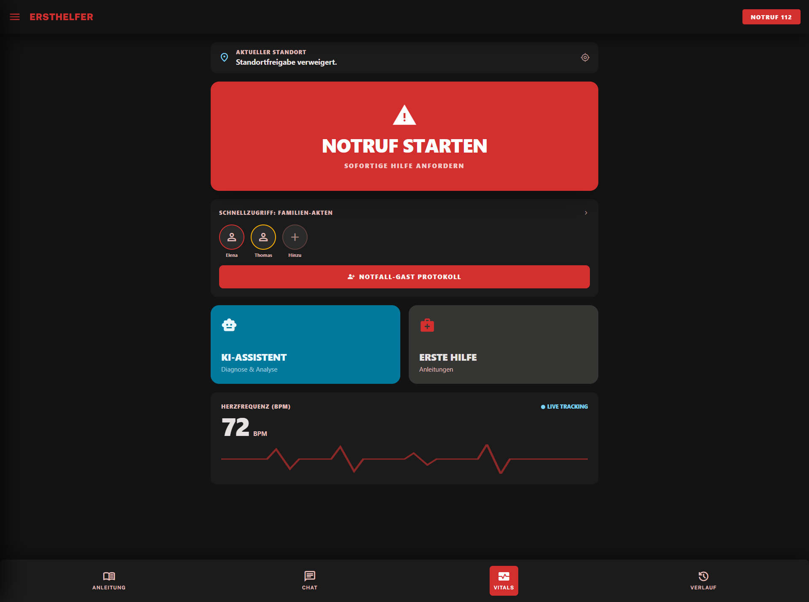
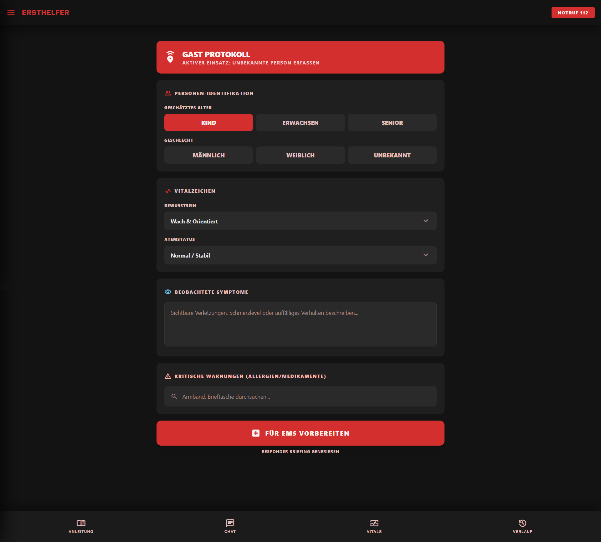
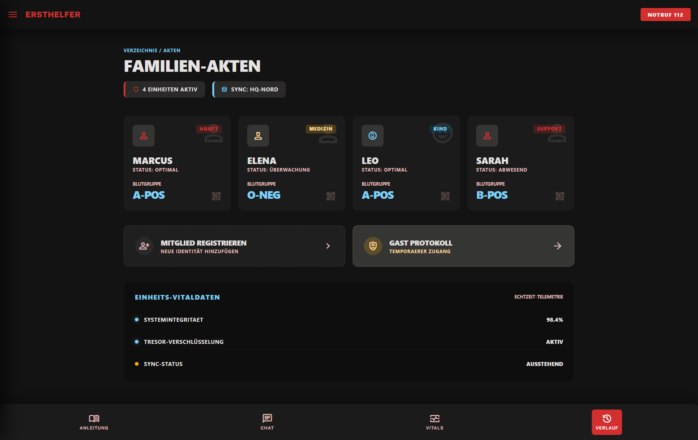
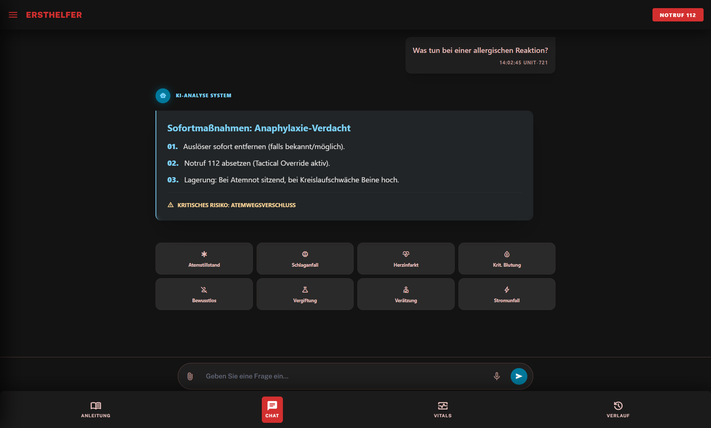
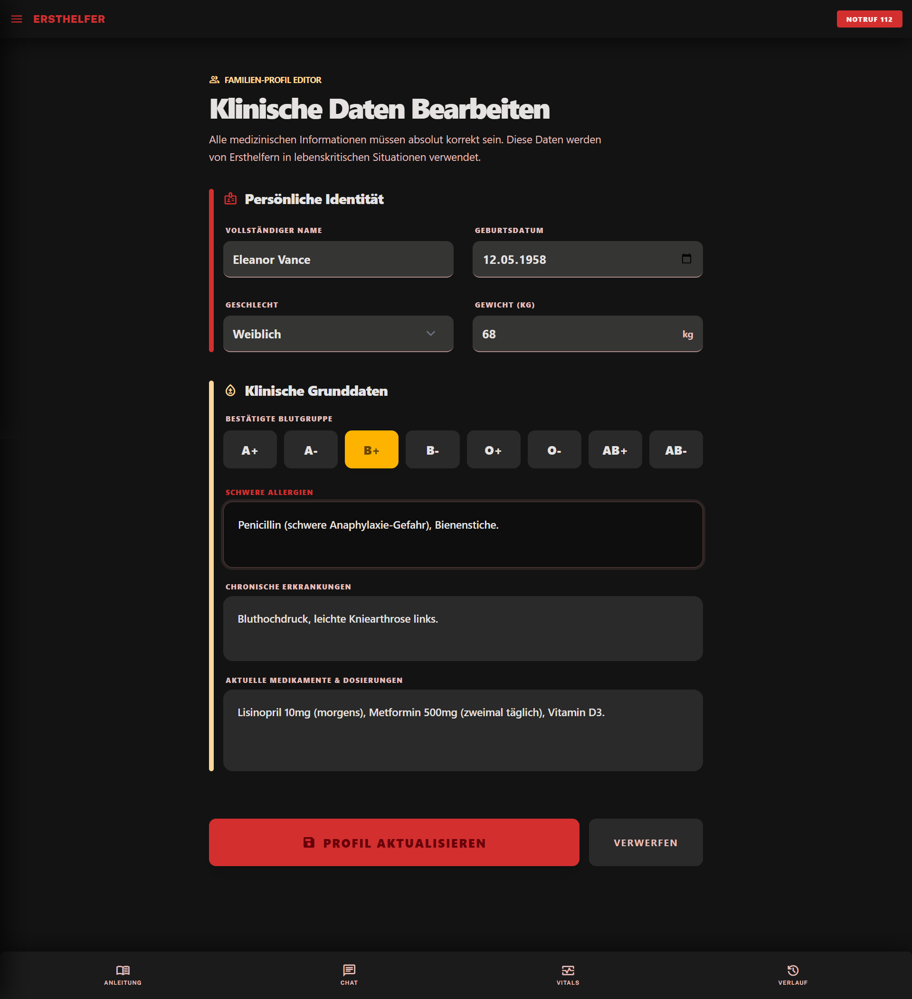
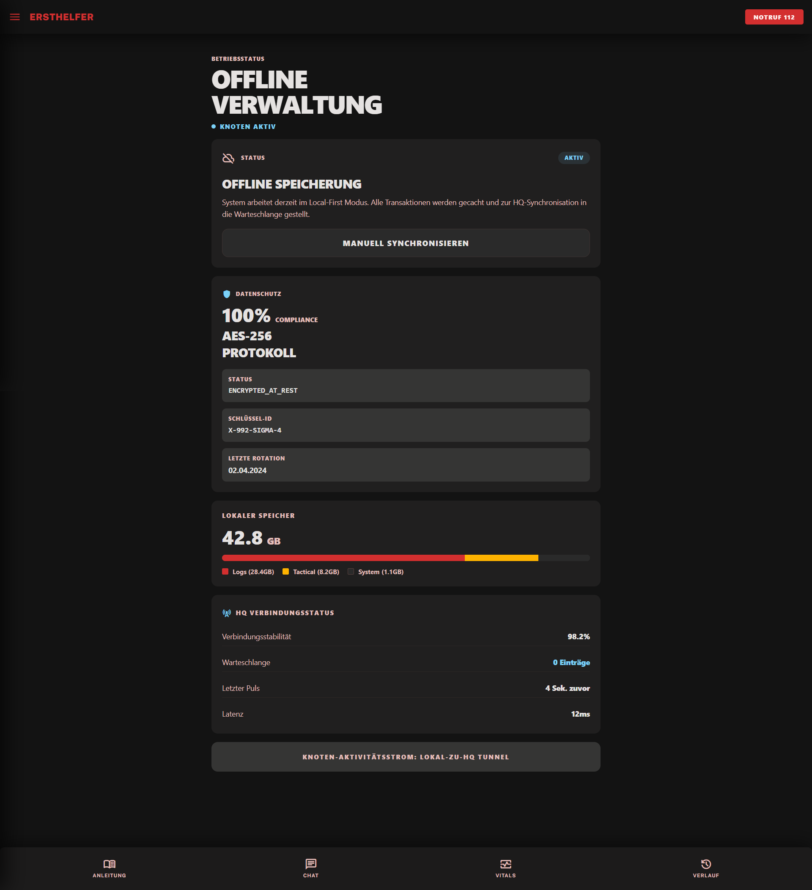
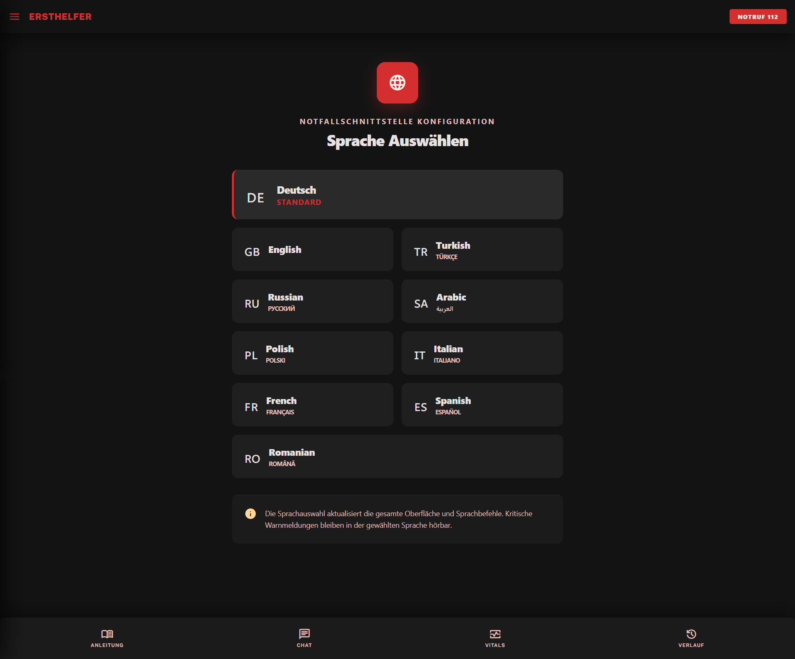
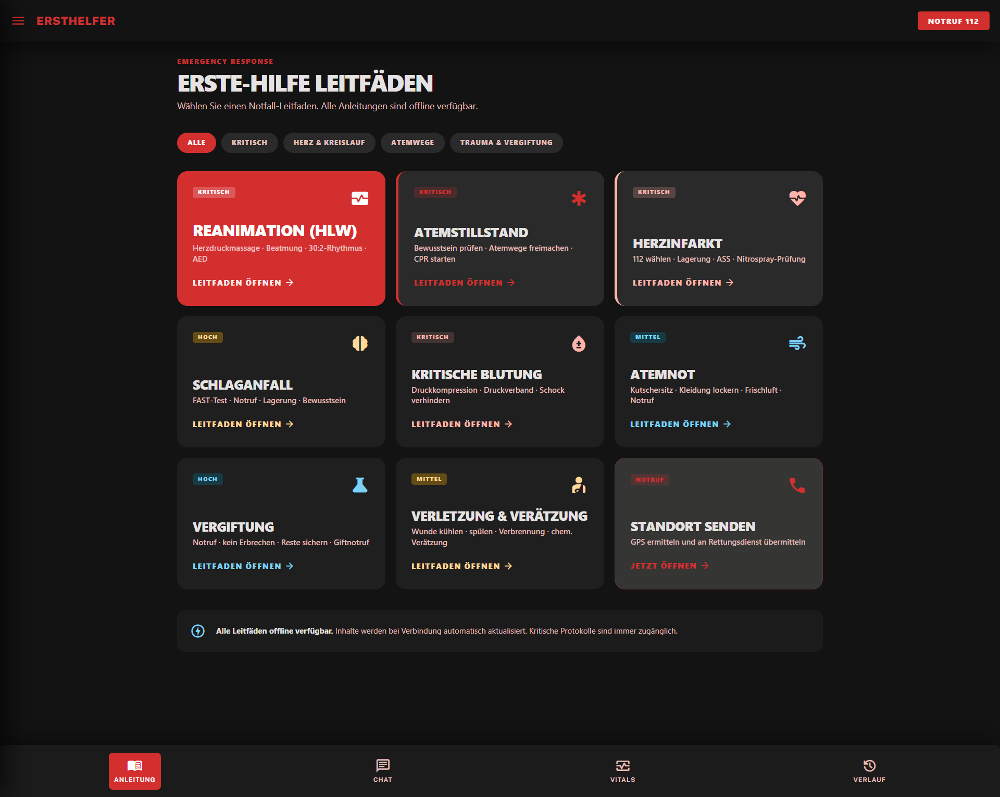
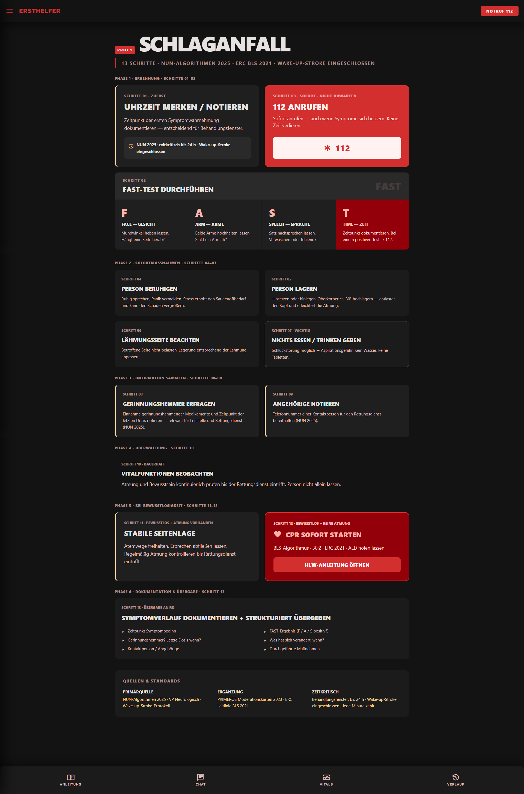
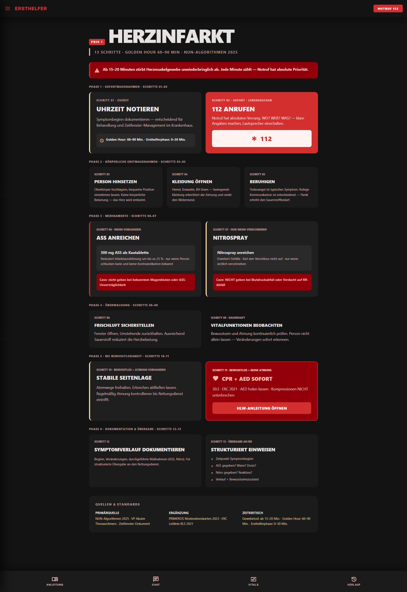

# Hybrid-Chatbot zur Automatisierung der Rettungskette 

**Ein Notfall-Chat-Assistent zur strukturierten Unterstützung ungeschulter Ersthelfer während der kritischen Überbrückungszeit bis zum Eintreffen des Rettungsdienstes.**

---

### Motivation

In medizinischen Notfallsituationen entscheiden oft die ersten Minuten über den Behandlungserfolg. Ungeschulte Ersthelfer leiden in diesen Stressmomenten häufig unter Entscheidungsblockaden oder Unsicherheit bezüglich korrekter Erste-Hilfe-Maßnahmen. Dieses Projekt entstand aus der Notwendigkeit, eine deterministische, leitlinienkonforme (ERC 2021) und jederzeit griffbereite Anleitung bereitzustellen, die Fehlentscheidungen minimiert und die Kommunikation mit der Rettungskette optimiert.

### Kernfeatures
* **Geführte Notfall-Interviews**: Strukturierte Abfrage von Symptomen basierend auf medizinischen Algorithmen (z. B. Schlaganfall, Herzinfarkt, Atemwegsverlegung).
* **Echtzeit-Standortermittlung**: Automatisierte Bestimmung der GPS-Koordinaten und Reverse-Geocoding der Adresse via OpenStreetMap zur präzisen Standortdurchsage.
* **Gast-Protokollierung**: Modul zur Erfassung von Patientendaten (geschätztes Alter, Symptome, kritische Warnungen wie Allergien) zur strukturierten Übergabe an den Rettungsdienst (EMS).
* **Interaktive Erste-Hilfe-Anleitungen**: Visuelle und textuelle Unterstützung für Sofortmaßnahmen wie stabile Seitenlage oder CPR-Taktung.
* **API-KI-gestützte Analyse**: Integration einer Schnittstelle zur Klassifikation komplexer Symptombilder (optionales Modul, Backup).
* **Offline-First-Fähigkeit**: Lokale Persistenz von Sitzungsdaten via Web Storage API zur Sicherstellung der Funktionalität bei instabiler Netzabdeckung.

### Tech Stack
* **Frontend**: Vanilla JavaScript (ES6+), HTML5, CSS3.
* **Styling**: Tailwind CSS (Utility-First-Ansatz) (vorübergehend und in spätere Produktion flexibel austauschbar).
* **Architektur**: Finite State Machine (FSM) zur Prozesssteuerung, Model-View-Update (MVU) Pattern, Observer Pattern.
* **APIs**: Geolocation API, OpenStreetMap Nominatim (Geocoding), Web Crypto API (Verschlüsselung).
* **Deployment**: Vercel.

### Architektur

Das System folgt einem strikt serverlosen Ansatz („Privacy by Design“), bei dem sämtliche Datenverarbeitungen clientseitig stattfinden. Die Kernlogik wird durch eine Finite State Machine gesteuert, die sicherstellt, dass Ersthelfer nur zulässige und medizinisch sinnvolle Pfade innerhalb der Notfall-Algorithmen durchlaufen. Die Trennung von Zustand und Darstellung erfolgt über ein MVU-Pattern, um eine hohe Wartbarkeit ohne den Overhead moderner Frameworks zu gewährleisten.

### Screenshots 

  
  
  
  
  
  
  
  
  
  

### Status
Work in Progress - MVP Phase (Phasen 1-3 abgeschlossen: Datenmodellierung, Core-FSM und UI-Prototyping implementiert).

---
